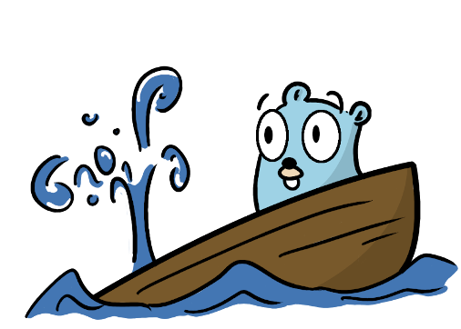

<!--
theme: gaia
class: invert
headingDivider: 2 
paginate: true
style: |
    section{
      justify-content: flex-start;
    }
    img[alt~="right"] {
      float: right;
    }
-->

<!--
_class: lead invert
-->

# Shipping Go without Sinking

A deep dive into releasing a Go binary

## Speaker Introduction

- **Name:** Sebastian Spaink
- Software Engineer at InfluxData
- 40+ releases of Telegraf

<!-- This is a presenter note for this page. -->
<!-- EXAMPLE: An EXAMPLE directive is not defined in Marp/Marpit, so this works as presenter notes. -->
## What is Telegraf?

Collect data, organizes it, and push it where you want

- Written in Go
- Open Source, MIT License
- 12k Github stars

## Releasing a Go binary

- Single Binary
- Cross Platform
- Dockerfile
