<!--
theme: gaia
class: invert
headingDivider: 2
paginate: true
style: |
    section{
      justify-content: flex-start;
    }
    img[alt~="right"] {
      float: right;
    }
-->

<!--
_class: lead invert
-->

# Shipping Go Without Sinking

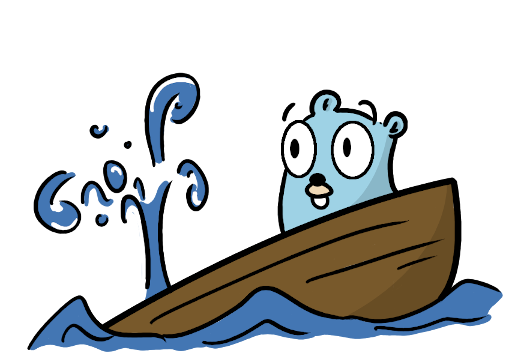

Go West Conference 2022

## Speaker Introduction

- **Name:** Sebastian Spaink
- Writing Go for 4 years
- Software Engineer at InfluxData

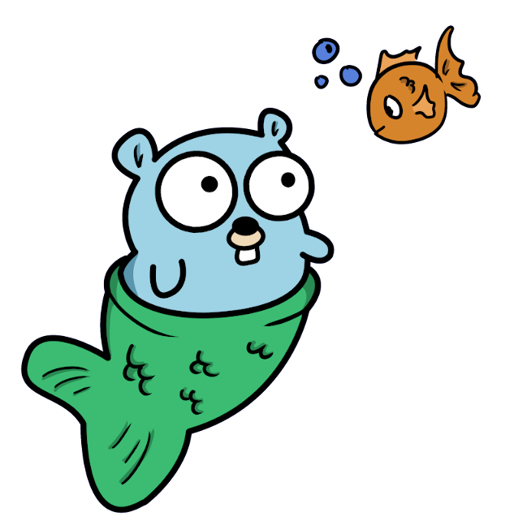

## What is Telegraf?

Collect data, organizes it, and push it where you want


- 40+ releases of Telegraf
- Open Source, MIT License
- 1000+ Unique Contributors


## A successful release of Telegraf


- Single Binary
- Cross Platform
- Dockerfile + Helm Chart
- Announce release

# **Before** Release Day

<!--
_class: lead invert
-->

## When? **The Release Cycle**

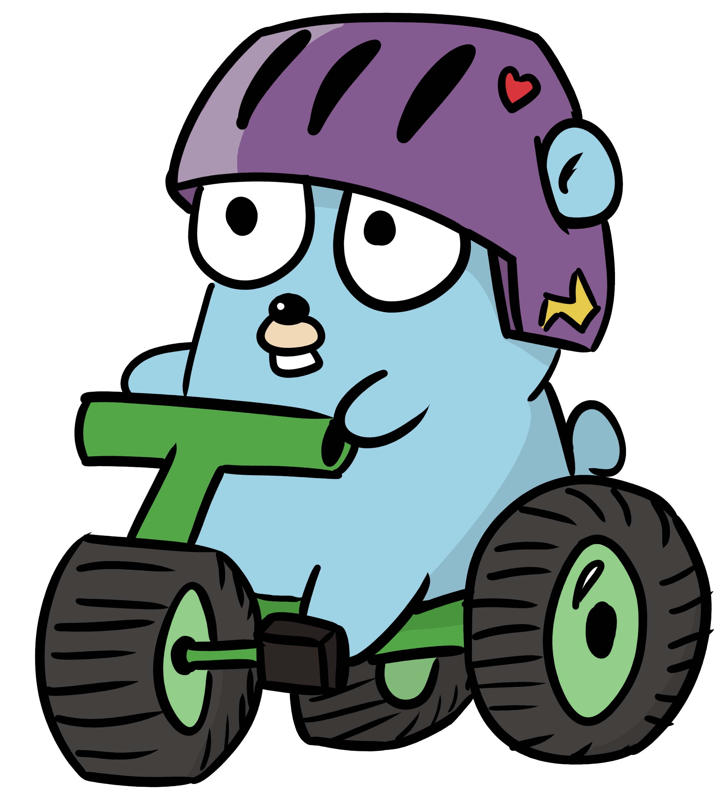

### Feature releases

- End of every quarter
(March, June, September, December)

### Maintenance releases

- Every 3 weeks

<!-- deprecated release candidates -->
<!-- every month releases in future -->

## Semantic Versioning

**example current version** 1.19.0

| Type       | Version | Description                           |
| -----------|---------|---------------------------------------|
| **Patch:** | 1.19.1  | maintenance release                   |
| **Minor:** | 1.20.0  | feature release                       |
| **Major:** | 2.0.0   | feature release with breaking changes |

## Semantic Versioning In Go

```go
// "github.com/Masterminds/semver"
// Version represents a single semantic version.
type Version struct {
    major, minor, patch int64
    pre                 string
    metadata            string
    original            string
}

currentVersion, _ := semver.NewVersion(version)
nextVersion := currentVersion.IncMinor()
```

## Conventional Commit Messages

Adding human and machine readable meaning to commit messages

**Example:** feat(inputs.directory_monitor): Traverse sub-directories
| Type | Optional Scope       | Description |
| -----------                 | -----------                  | -----------  |
| feat          | inputs.directory_monitor           | Traverse sub-directories |

## Automatic Alpha Builds

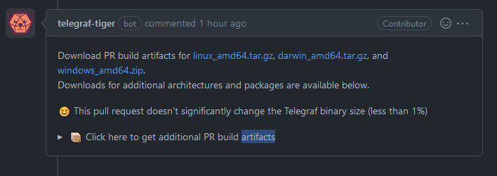

## Keep things **tidy**

```makefile
.PHONY: tidy
tidy:
    go mod verify
    go mod tidy
    @if ! git diff --quiet go.mod go.sum; then \
        echo "please run go mod tidy and check in changes,
        you might have to use the same version of Go as the CI"; \
        exit 1; \
    fi
```

## Lint free code: **golangci-lint**


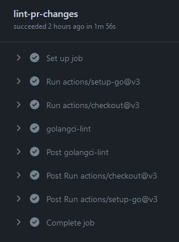

## Staying updated

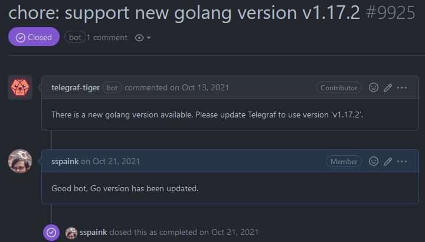
https://go.dev/VERSION?m=text

## Release Day

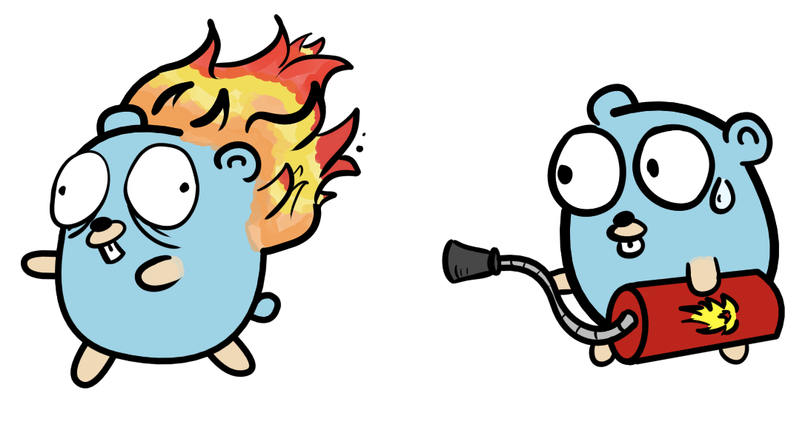

<!--
_class: lead invert
-->

## Starting the Release

- Eeny, meeny, miny moe, Catch a tiger by the toe
- Track progress in slack

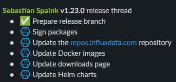

## Steps Overview

1. Prepare release branch
2. Building and packaging
3. Announcing the release

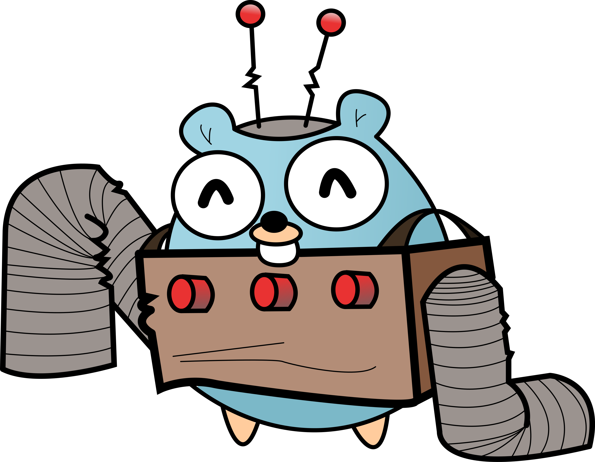

<!--
_class: lead invert
-->

## Prepare release branch


<!--
_class: lead invert
-->

## Git branching strategy

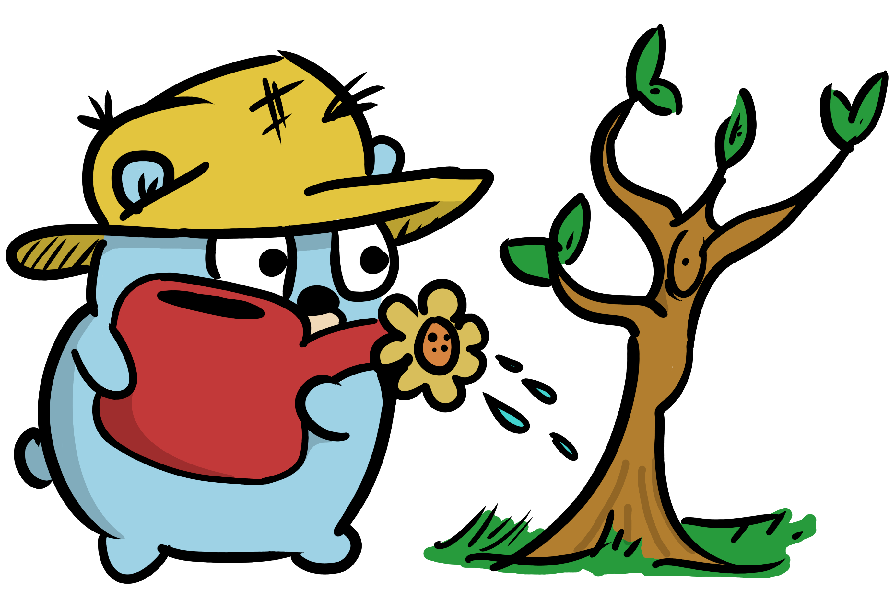

- copy master branch
- branch for each release
- maintain release branch

## Executing external commands

```go
func RunCommand(path, command string, arguments ...string) (string, error) {
    var w io.Writer
    var stdBuffer bytes.Buffer
    w = io.MultiWriter(os.Stdout, &stdBuffer)

    cmd := exec.Command(command, arguments...)
    cmd.Dir = path
    cmd.Stdout = w
    cmd.Stderr = w
    err := cmd.Run()
    if err != nil {
        return "", err
    }
    return stdBuffer.String(), nil
}
```

## Adding some color

```go
// Wrap color implements the io.Writer interface
// Using fatih/color package it prints to stdout but with color
type WrapColor struct{}

func (w *WrapColor) Write(b []byte) (int, error) {
    color.Cyan(string(b))
    return len(b), nil
}

…………

var w io.Writer
var stdBuffer bytes.Buffer
var c WrapColor
w = io.MultiWriter(&c, &stdBuffer)
```

## Working with git commits

```go
type Commit struct {
    Hash            string
    AuthorName      string
    Type            string // (e.g. `feat`)
    Scope           string // (e.g. `core`)
    Subject         string // (e.g. `Add new feature`)
    Title           string // (e.g. `feat(core): Add new feature`)
}
```

## Collecting git commits

```go
separator := "@@__CHGLOG__@@"
delimiter := "@@__CHGLOG_DELIMITER__@@"
logFormat := separator + strings.Join([]string{
    "HASH",
    "AUTHOR",
    "SUBJECT",
    "BODY",
}, delimiter)

arguments := []string{"log", fmt.Sprintf("--pretty=%s", logFormat), fromBranch + ".." + toBranch}
RunCommand(path, "git", arguments...)
```

## Update git branches

```go
// maintenance release
for _, c := range commits {
    fmt.Println(color.YellowString("Cherry-pick this commit?: %s", c.Title))
    response, _ = prompt.Run()
    switch response {
    case "Y", "y":
        arguments = []string{"cherry-pick", "-x", c.Hash}
        _, err := RunCommand(path, "git", arguments...)
    }
}
// feature release
arguments := []string{"checkout", "-b", branchName}
output, err := RunCommand(path, "git", arguments)

RunCommand(path, "make", "test")
```

## Changelog template

```yaml
## {{ .Version }} [{{ .Date }}]
{{ range .CommitGroups }}
### {{ println .Title }}
{{ range .Commits -}}
- {{.PullRequestLink}} {{ if .Scope }}`{{ .Scope }}` {{ end }}{{ println .Subject }}
{{- end -}}
{{ end -}}
```

## **Example**

### v1.24.1 [2022-09-19]

#### Bugfixes

- [#11787](https://github.com/influxdata/telegraf/pull/11787) Clear error message when provided config is not a text file

#### Dependency Updates

- [#11788](https://github.com/influxdata/telegraf/pull/11788) `deps` Bump cloud.google.com/go/pubsub from 1.24.0 to 1.25.1

## **Preparing the code:** lessons learned

- Conventional commit messages unlocks automation
- Automate using Go

## **Preparing the code:** future improvements

- Don't wait for release day
  - Cherry-pick continously
  - Update changelog continuously

Challenges:

- What if change is fixing a feat?

## Building and Packaging

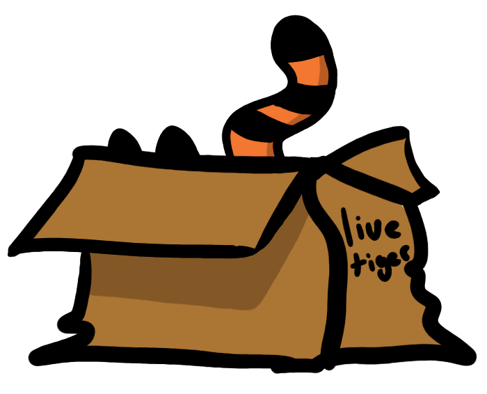

<!--
_class: lead invert
-->

##

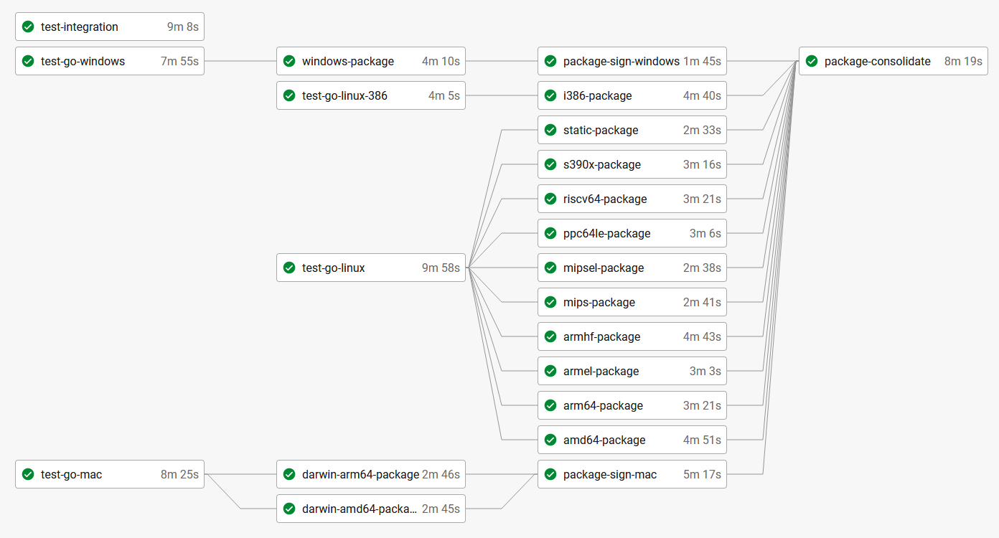

## Build tags

Identifier added to determine when code should be included in build

| Syntax after Go v1.17       | Syntax before Go v1.17       |
| -----------                 | -----------                  |
| //go:build windows          | // +build windows            |
| //go:build linux && amd64   | // +build linux,amd64        |

## Architectures Defined

```makefile
# e.g. make package include_packages="$(make amd64)"
arm64 += linux_arm64.tar.gz arm64.deb aarch64.rpm
.PHONY: arm64
arm64:
    @ echo $(arm64)
amd64 += freebsd_amd64.tar.gz linux_amd64.tar.gz amd64.deb x86_64.rpm
.PHONY: amd64
amd64:
    @ echo $(amd64)
windows += windows_i386.zip windows_amd64.zip
.PHONY: windows
windows:
    @ echo $(windows)
....
```

## make build

use -ldflags to change the value of variables at build time

```makefile
tag := $(shell git describe --exact-match --tags 2>/dev/null)
version := $(tag:v%=%)

INTERNAL_PKG=github.com/influxdata/telegraf/internal
LDFLAGS := -X $(INTERNAL_PKG).Version=$(version)

.PHONY: build
build:
    go build -ldflags "$(LDFLAGS)" ./cmd/telegraf
```

## make package

```makefile
include_packages := $(mips) $(mipsel) $(arm64) $(amd64) $(static) $(armel)
$(armhf) $(riscv64) $(s390x) $(ppc64le) $(i386) $(windows) $(darwinamd64) $(darwinarm64)

.PHONY: $(include_packages)
$(include_packages):
    @$(MAKE) install
    @mkdir -p $(pkgdir)

    @if [ "$(suffix $@)" = ".rpm" ]; then \
        fpm ...
    elif [ "$(suffix $@)" = ".deb" ]; then \
        fpm ....
    elif [ "$(suffix $@)" = ".zip" ]; then \
        (cd $(dir $(DESTDIR)) && zip -r - ./*) > $(pkgdir)/telegraf-$(tar_version)_$@ ;\
    elif [ "$(suffix $@)" = ".gz" ]; then \
        tar -czvf $(pkgdir)/telegraf-$(tar_version)_$@ -C $(dir $(DESTDIR)) . ;\
    fi
```

## Mage

Mage is a make/rake-like build tool using Go.

```go
func build(p platform) (string, error) {
    env := map[string]string{"GOOS": p.OS, "GOARCH": p.ARCH}
    folderName := fmt.Sprintf("%s_%s", p.OS, p.ARCH)
    binName := productName + p.Extension
    filePath := filepath.Join("bin", folderName, binName)
    _ := runCmd(env, "go", "build", "-o", filePath, "cmd/main.go")

    return filePath, nil
}
```

Check it out: https://github.com/magefile/mage

## Adding version and icon to Windows

Using package josephspurrier/goversioninfo

```go
//go:generate goversioninfo -icon=../../assets/windows/tiger.ico
```

```json
{
 "StringFileInfo": {
  "ProductName": "Telegraf",
  "ProductVersion": "1.25.0-71b4a0af"
 }
}
```

## Generating **versioninfo.json**

```go
version, _ := exec.Command("make", "version").Output()

v := VersionInfo{
    StringFileInfo: StringFileInfo{
        ProductName:    "Telegraf",
        ProductVersion: version,
    },
}

if err := ioutil.WriteFile("cmd/telegraf/versioninfo.json", file, 0644); err != nil {
    log.Fatalf("Failed to write versioninfo.json: %v", err)
}
```

##

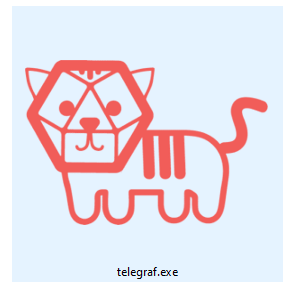

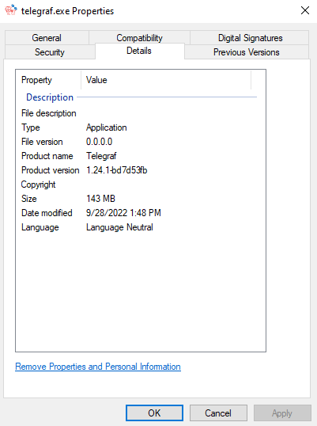

## Update Package Repository

- Sign artifacts with GPG key
- Upload to S3 bucket
- Update http://repos.influxdata.com/

## **Building and Packaging:** lessons learned

- Make artifacts readily available
- Sign mac nightly, replicate release pipeline

## Announcing the release


<!--
_class: lead invert
-->

## Update multiple locations

- influxdata/telegraf (public)
- influxdata/influxdata-docker (public)
- influxdata/official-images (public, fork of docker-library)
- influxdata/helm-charts (public)
- influxdata/website (private)

##

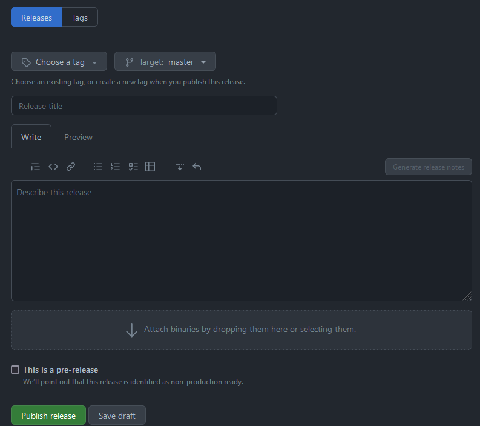

##

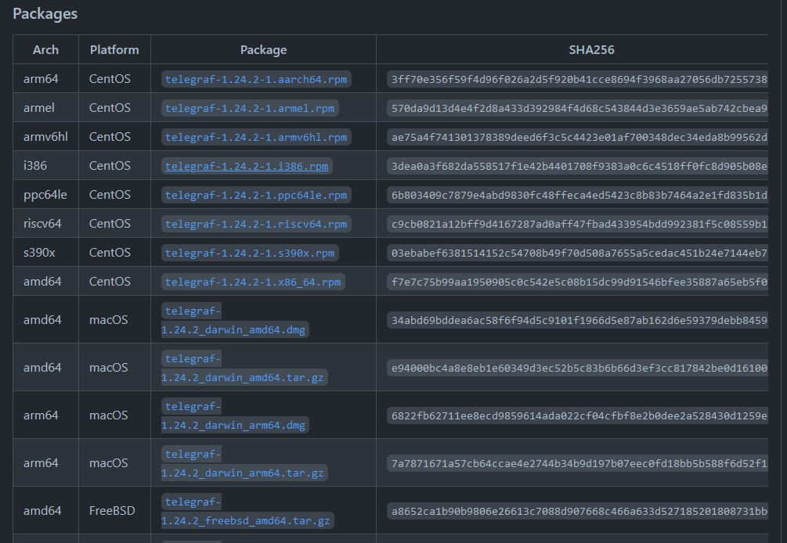

## https://portal.influxdata.com/downloads/

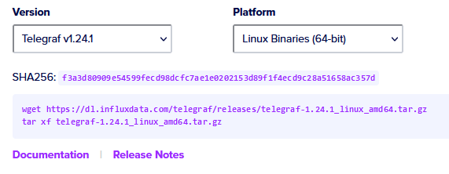

## Updating the Website

```go
b, err = sjson.SetBytes(b, "telegraf_stable.version", version)
if err != nil {
    return nil, fmt.Errorf("failed to set telegraf_stable.version: %w", err)
}
```

## Update Docker manifest.json

```go
// Read the manifest file to determine current versions and add latest version
type Manifest struct {
    Name          string     `json:"name"`
    Maintainers   []string   `json:"maintainers"`
    Versions      []string   `json:"versions"`
    Architectures []string   `json:"architectures"`
    Variants      []Variants `json:"variants"`
}

ver, _ := semver.NewVersion(version)

// Drop oldest version and add newest version
var oldestVersion string
oldestVersion, m.Versions = m.Versions[0], m.Versions[1:]
m.Versions = append(m.Versions, fmt.Sprintf("%d.%d", ver.Major(), ver.Minor()))
```

##

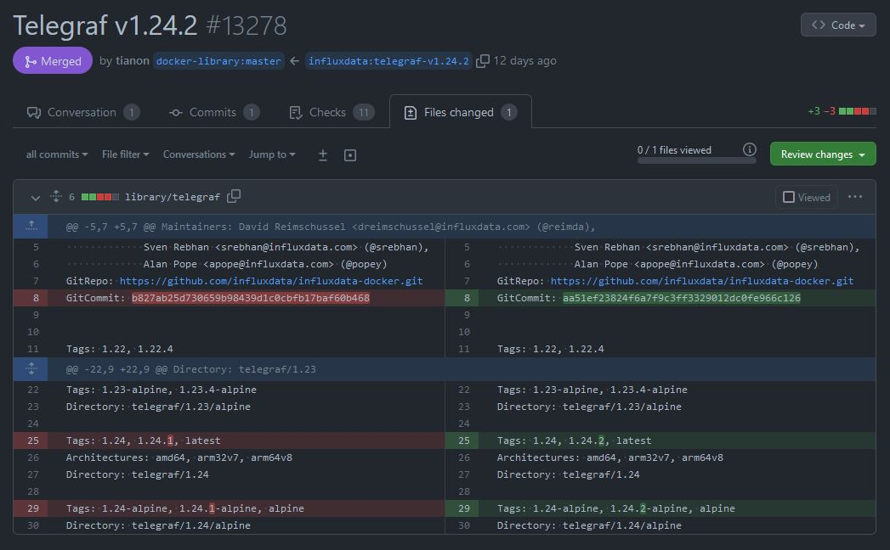

## Testing Dockerfile

```go
container, _ := testcontainers.GenericContainer(ctx,
testcontainers.GenericContainerRequest{
    ContainerRequest: req,
    Started:          true,
})

name, _ := container.Name(ctx)

cmd := exec.Command("docker", "exec", name, "telegraf", "--version")
out, _ := cmd.CombinedOutput()

// Verify the correct version of Telegraf exists
if !strings.Contains(string(out), ver.String()) {
    return fmt.Errorf("Expected Telegraf version %s but got %s", version, string(out))
}
```

## Update Helm Chart

```go

import yaml "gopkg.in/yaml.v3"

var n yaml.Node
err := yaml.Unmarshal(data, &n)
if err != nil {
    return nil, fmt.Errorf("failed to unmarshal YAML: %w", err)
}

_, err = walkContent(&n, "tag", fmt.Sprintf("%d.%d-alpine", version.Major(), version.Minor()))
if err != nil {
    return nil, fmt.Errorf("failed to update tag in YAML: %w", err)
}

updated, err := yaml.Marshal(&n)
if err != nil {
    return nil, fmt.Errorf("failed to marshal YAML: %w", err)
}
```

##

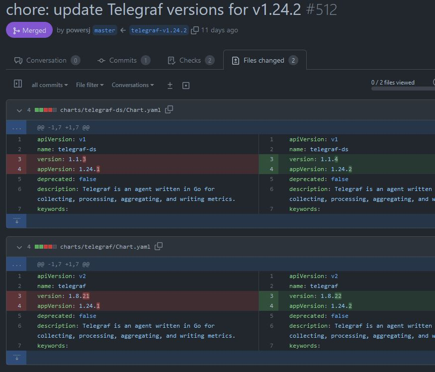

## **Distributing Binaries:** lessons learned

- If there is a problem increment patch, or the hash will change

## Conquering a Major Release

- Breaking changes
- Backwards compatibility important
- Deprecating configuration options slowly
- Getting into the habit

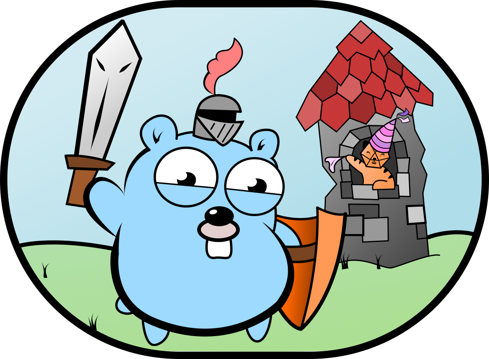
