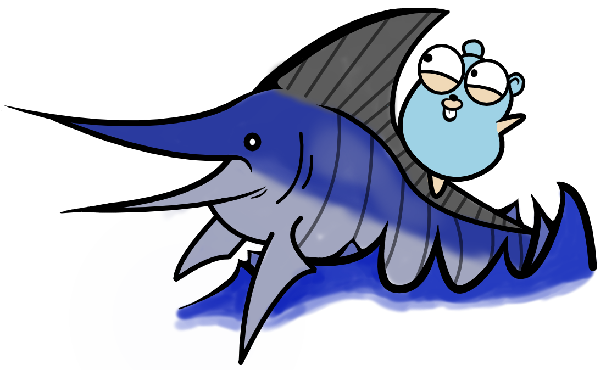

<!--
theme: gaia
class: invert
headingDivider: 2 
paginate: true
style: |
    section{
      justify-content: flex-start;
    }
    img[alt~="right"] {
      float: right;
    }
-->

<!--
_class: lead invert
-->

# Shipping Go Without Sinking


Go West Conference 2022

## Speaker Introduction

- **Name:** Sebastian Spaink
- Software Engineer at InfluxData
- 40+ releases of Telegraf


<!-- This is a presenter note for this page. -->
<!-- EXAMPLE: An EXAMPLE directive is not defined in Marp/Marpit, so this works as presenter notes. -->

## What is Telegraf?

Collect data, organizes it, and push it where you want


- Written in Go
- Open Source, MIT License
- 12k Github stars


## Important aspects



- Single Binary
- Cross Platform
- Github Release
- Dockerfile

## **Release Cycle**


### Maintenance releases

- Every 3 weeks
- bug/security fixes, dependency updates

### Feature releases

- End of every quarter (March, June, September, December)
- Contains new features + fixes and updates

## Starting the Release

- Eeny, meeny, miny moe, Catch a tiger by the toe
- Track progress in slack


## Steps Overview

1. Preparing the code
2. Building and packaging
3. Distributing the binaries


<!--
_class: lead invert
-->

## Preparing the code


<!--
_class: lead invert
-->

## Build tags

Identifier added to determine when code should be included in build

| Syntax after Go v1.17       | Syntax before Go v1.17       |
| -----------                 | -----------                  |
| //go:build windows          | // +build windows            |
| //go:build linux && amd64   | // +build linux,amd64        |

## Dependency updates

Telegraf has **421 packages** it is dependents on!
Dependabot a Github solution to automate dependency updates.

```yaml
version: 2
updates:
  - package-ecosystem: "gomod"
    directory: "/"
    schedule:
      interval: "weekly"
```

## Conventional Commit Messages

Adding human and machine readable meaning to commit messages

**Example:** feat(inputs.directory_monitor): Traverse sub-directories
| Type | Optional Scope       | Description |
| -----------                 | -----------                  | -----------  |
| feat          | inputs.directory_monitor           | Traverse sub-directories |

## Git branching strategy


- master branch
- release branch
- release tag

## Executing external commands

```go
func RunCommand(path, command string, arguments ...string) (string, error) {
    var w io.Writer
    var stdBuffer bytes.Buffer
    w = io.MultiWriter(os.Stdout, &stdBuffer)
    
    cmd := exec.Command(command, arguments...)
    cmd.Dir = path
    cmd.Stdout = w
    cmd.Stderr = w
    err := cmd.Run()
    if err != nil {
        return "", err
    }
    return stdBuffer.String(), nil
}
```

## Adding some color

```go
// Wrap color implements the io.Writer interface
// Using fatih/color package it prints to stdout but with color
type WrapColor struct{}

func (w *WrapColor) Write(b []byte) (int, error) {
    color.Cyan(string(b))
    return len(b), nil
}

…………

var w io.Writer
var stdBuffer bytes.Buffer
var c WrapColor
w = io.MultiWriter(&c, &stdBuffer)
```

## Collecting git commits

```go
type Commit struct {
    Hash            string
    AuthorName      string
    Type            string // (e.g. `feat`)
    Scope           string // (e.g. `core`)
    Subject         string // (e.g. `Add new feature`)
    Title           string // (e.g. `feat(core): Add new feature`)
}
separator := "@@__CHGLOG__@@"
delimiter := "@@__CHGLOG_DELIMITER__@@"
logFormat := separator + strings.Join([]string{
    "HASH", 
    "AUTHOR",
    "SUBJECT",
    "BODY",
}, delimiter)

arguments := []string{"log", fmt.Sprintf("--pretty=%s", logFormat), fromBranch + ".." + toBranch}
RunCommand(path, "git", arguments...)
```

## Changelog template

```yaml
## {{ .Version }} [{{ .Date }}]
{{ range .CommitGroups }}
### {{ println .Title }}
{{ range .Commits -}}
- {{.PullRequestLink}} {{ if .Scope }}`{{ .Scope }}` {{ end }}{{ println .Subject }}
{{- end -}}
{{ end -}}
```

## **Example**

### v1.24.1 [2022-09-19]

#### Bugfixes

- [#11787](https://github.com/influxdata/telegraf/pull/11787) Clear error message when provided config is not a text file

#### Dependency Updates

- [#11788](https://github.com/influxdata/telegraf/pull/11788) `deps` Bump cloud.google.com/go/pubsub from 1.24.0 to 1.25.1

## **Preparing the code:** lessons learned

- Organizing commits with conventional commit messages
- Write the release tools the team knows best
- Allow tools to be re-run

## **Preparing the code:** future improvements

- Cherry-pick changes into release branch continuously
- Update changelog continuously
